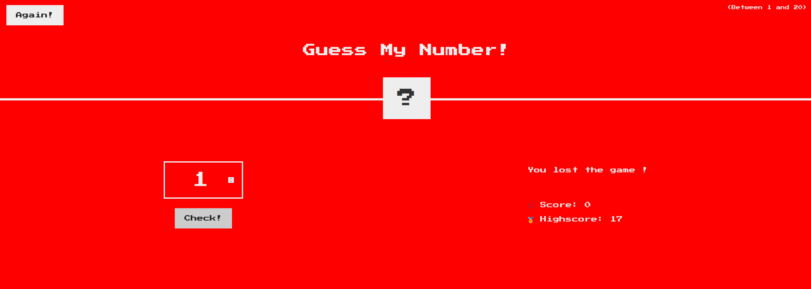

# Guess-my-number
Project in Javascript from Jonas Schmedtmann Javascript course on Udemy.
The rules of the game are quite simple: you have to guess the correct number hidden behind the "?".
You start with a score of 20 points, and each incorrect answer decreases your starting score by one point.
Your best score will be displayed in the "highscore".
You can access the game by clicking on the following link: https://fabulous1996.github.io/Guess-my-number/
Have fun !

# Game photo

